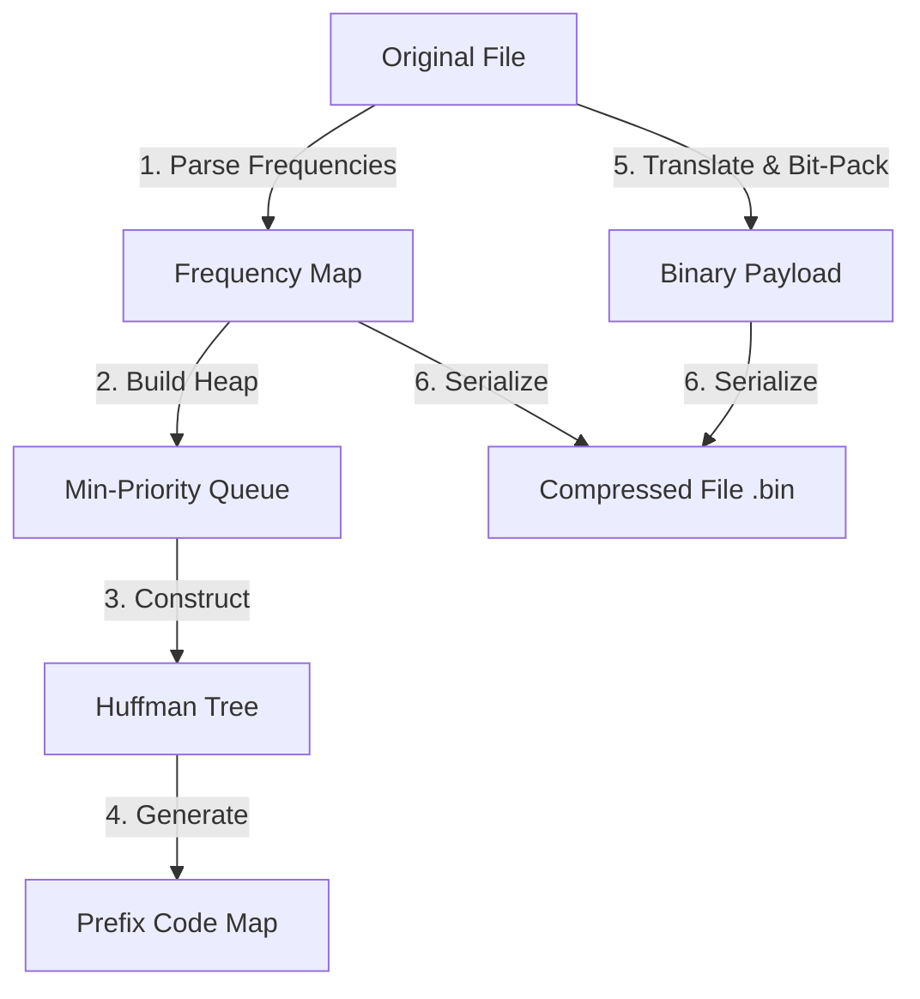

# Huffman Coding File Compressor

A high-performance command-line utility built from scratch in C++ to compress and decompress files using the **Huffman Coding** lossless compression algorithm. 

This project demonstrates the practical application of fundamental data structures (Binary Trees, Min-Heaps/Priority Queues, Hash Maps) and system-level operations (bit manipulation, binary file serialization, and Custom Application Formats).

---

## 🛠️ Features

- **Lossless Compression**: Reconstructs compressed files back to their exact original byte-for-byte state.
- **Custom Binary File Format**: Employs a self-contained header serialization scheme storing the original file size (to prevent trailing bit decoding) and the character frequency map.
- **Deterministic Tree Construction**: Resolves priority queue non-determinism (equal frequency collision) using a subtree minimum character (`min_char`) tie-breaking rule, ensuring identical tree regeneration during decompression.
- **High Efficiency**: Achieves **~43% space reduction** on standard text documents.
- **Robust Verification**: Includes a comprehensive Bash test suite covering extreme edge cases like empty files, single-character repetitions, and arbitrary binary payloads.

---

## 📐 Architecture & Workflow

### Compression Flow


---

## 🚀 Getting Started

### Prerequisites
- A C++17 compatible compiler (e.g., `g++` or `clang++`)
- GNU Make

### Building the Project
Clone the repository and build the binary using the provided `Makefile`:
```bash
# Navigate to the project directory
cd huffman-compressor

# Compile the project
make
```
This compiles the code with `-O3` optimizations and generates the `huffman` executable.

---

## 💻 Usage

### 1. Compression
To compress an input file:
```bash
./huffman -c <input_file> <output_compressed_file>
```
*Example:*
```bash
./huffman -c sample.txt compressed.bin
```

### 2. Decompression
To decompress a previously compressed `.bin` file:
```bash
./huffman -d <compressed_file> <output_restored_file>
```
*Example:*
```bash
./huffman -d compressed.bin restored.txt
```

---

## 🧪 Automated Testing
Run the verification script to build the code, execute all edge-case scenarios, and verify the outputs using `diff`:
```bash
chmod +x test.sh
./test.sh
```

### Test Scenarios Covered
| Test Name | Focus Area | Result |
|---|---|---|
| **Standard Text File** | Multi-frequency character encoding | Pass ✅ |
| **Empty File** | Corner case handling of 0-byte input | Pass ✅ |
| **Single Character Repeating** | Maximum frequency single-node edge case | Pass ✅ |
| **Binary/Non-ASCII Data** | Correct reading and writing of arbitrary byte streams | Pass ✅ |
| **Large Text File** | Compression ratio and speed efficiency check | Pass (57.21% space footprint) ✅ |

---

## 🧹 Cleaning Up
To remove object files and compiled binaries:
```bash
make clean
```
